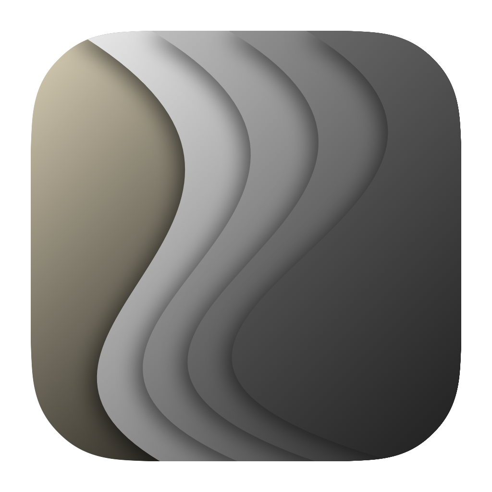

<p align="center">
  
</p>
<h1 align="center">ClamShell</h1>
<p align="center">The iPhone fold effect, on your MacBook.</p>

I vibe coded this just for fun. Close your lid and watch the desktop fold with it.
Stop midway and it snaps back after half a second.

## Try it

Download the app from [Releases](https://github.com/nthanhtin/ClamShell/releases/latest)
for Apple Silicon Macs running macOS 14 or later.

To build from source, use Xcode with Metal tools and an Apple Development
signing certificate in your keychain.

```sh
bash build.sh
open build/ClamShell.app
```

Choose **Perspective fold**, allow Screen Recording, then enable desktop animation.
**Native blur** keeps the desktop live and needs no capture permission.
The preview slider lets you try the fold without moving your lid.

## Make it yours

- Adjust the start and end angles in the main window.
- Open **Animation settings** (`⌘,`) for timeout, movement threshold, and smoothing.
- Turn on **Start at login** in the main window. Your settings are saved.

## A few notes

Tested on an M1 Pro MacBook Pro. Lid sensor access varies by model; manual preview
still works without it. The effect runs on your unlocked desktop, so it won't
appear over the lock screen after sleep. Desktop captures stay in memory.

Built with SwiftUI, Metal, IOKit, and ScreenCaptureKit.
Thanks to [LidAngleSensor](https://github.com/samhenrigold/LidAngleSensor) and
[mac-angle](https://github.com/ufoym/mac-angle) for the sensor research, and
[iphone-duo](https://github.com/chuspeeism/iphone-duo) for the fold reference.

Tests: `bash test.sh` · Regenerate the icon:
`bash Tools/render-assets.sh`.

## Release

Push a version tag to run the tests and publish an Apple Silicon app ZIP:

```sh
git tag v0.1.1
git push origin v0.1.1
```

No signing secrets needed. Downloads are ad hoc signed and aren't notarized;
see the [release notes](.github/release-notes.md) for opening them.

Licensed under [MIT](LICENSE).
